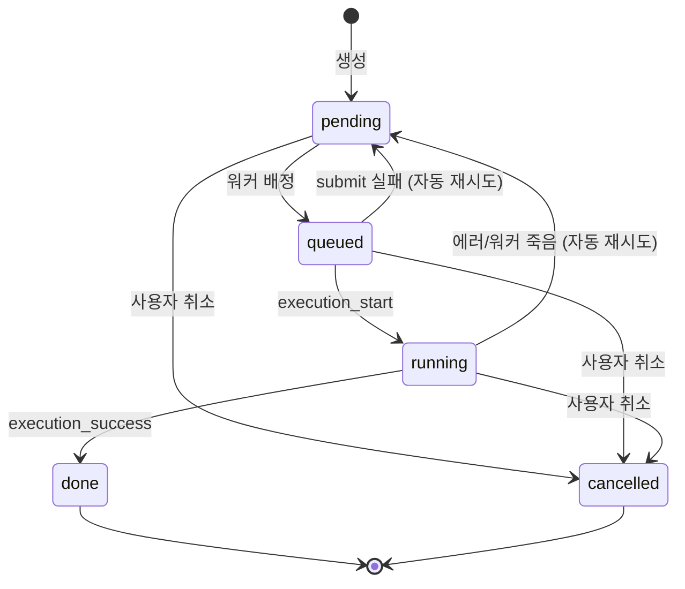

# ComfyEmotionGen Backend API Reference

> **Backend Version**: `0.1.0` (SemVer)
> **Framework**: FastAPI + aiosqlite
> **Base URL**: `http://localhost:8000` (기본값)

---

## Table of Contents

- [System](#system)
- [DSL Parser](#dsl-parser)
- [Jobs](#jobs)
- [Job Logs](#job-logs)
- [Image Proxy](#image-proxy)
- [Saved Images & Curation](#saved-images--curation)
- [Tags](#tags)
- [Trash](#trash)
- [Asset Groups](#asset-groups)
- [Export](#export)
- [Workers](#workers)
- [WebSocket Events](#websocket-events)
- [Pydantic Models](#pydantic-models)
- [Error Handling](#error-handling)

---

## System

### `GET /health`

백엔드 서버 및 워커 풀 상태 확인.

**Response**
```json
{
  "backend": "ok",
  "workers": [
    {
      "id": "worker-0",
      "url": "http://localhost:8188",
      "alive": true,
      "busy": false,
      "currentJobId": null
    }
  ]
}
```

---

### `GET /version`

백엔드/번들 버전 정보.

**Response**
```json
{
  "backend": "0.1.0",
  "bundle": "dev",
  "commit": null
}
```

---

### `GET /object_info`

ComfyUI 노드 정의 (`object_info.json`) 또는 워커에서 직접 조회.

> [!NOTE]
> 두 개의 라우트가 등록되어 있음:
> 1. 로컬 파일 `../object_info.json`이 존재하면 그것을 서빙
> 2. 없으면 alive 워커에서 `/object_info`를 프록시

**Response**: ComfyUI `object_info` JSON (노드 타입별 입출력 정의)

| Status | Description |
|--------|-------------|
| `200` | 성공 |
| `404` | 로컬 파일 없음 |
| `503` | 사용 가능한 워커 없음 |
| `502` | 워커 요청 실패 |

---

## DSL Parser

### `POST /render`

DSL 템플릿을 파싱하여 프롬프트 조합 리스트를 생성.

**Request Body** — [`RenderRequest`](#renderrequest)

```json
{
  "template": "axis emotion { happy = \"smiling face\", sad = \"crying\" }\ncombine emotion\ntemplate: {{ emotion }}\nfilename: {{ emotion.key }}",
  "only": { "emotion": ["happy"] },
  "fix": null,
  "skip_excludes": false,
  "extra_excludes": null,
  "limit": 0,
  "offset": 0
}
```

**Response** — [`RenderResponse`](#renderresponse)

```json
{
  "count": 1,
  "items": [
    {
      "filename": "happy",
      "prompt": "smiling face",
      "meta": { "emotion": "happy" }
    }
  ],
  "axes": {
    "emotion": {
      "include": null,
      "values": [
        { "key": "happy", "value": "smiling face", "props": {} },
        { "key": "sad", "value": "crying", "props": {} }
      ]
    }
  },
  "sets": {},
  "excludes": []
}
```

| Status | Description |
|--------|-------------|
| `200` | 성공 |
| `400` | DSL 문법 오류 (`DSLSyntaxError`) |

---

### `POST /workflow/inject`

워크플로우 JSON 내 플레이스홀더를 프롬프트 텍스트로 치환.

**Request Body** — [`InjectRequest`](#injectrequest)

```json
{
  "workflow": { "3": { "inputs": { "text": "{{input}}" }, "class_type": "CLIPTextEncode" } },
  "prompt": "a beautiful sunset",
  "placeholder": "{{input}}"
}
```

| Field | Type | Required | Description |
|-------|------|----------|-------------|
| `workflow` | `object` | ✅ | ComfyUI 워크플로우 JSON |
| `prompt` | `string \| object` | ✅ | 문자열 또는 `{placeholder: value}` 매핑 |
| `placeholder` | `string` | — | 기본값 `"{{input}}"` |

**Response**

```json
{
  "workflow": { "3": { "inputs": { "text": "a beautiful sunset" }, "class_type": "CLIPTextEncode" } }
}
```

---

## Jobs

### `POST /jobs`

잡 N개 등록. 프론트엔드에서 시드/치환 완료된 워크플로우를 제출.

**Request Body** — [`JobsCreateRequest`](#jobscreaterequest)

```json
{
  "items": [
    {
      "filename": "happy_portrait",
      "prompt": "smiling face, portrait",
      "workflow": { "1": { "inputs": { "seed": 12345 }, "class_type": "KSampler" } },
      "meta": { "emotion": "happy" },
      "cegTemplate": "..."
    }
  ]
}
```

**Response**

```json
{
  "jobIds": ["550e8400-e29b-41d4-a716-446655440000"]
}
```

---

### `GET /jobs`

잡 목록 조회 (필터링 + 페이지네이션).

**Query Parameters**

| Param | Type | Default | Description |
|-------|------|---------|-------------|
| `limit` | `int` | `100` | 페이지 크기 |
| `offset` | `int` | `0` | 오프셋 |
| `status` | `string?` | — | `pending`, `queued`, `running`, `done`, `error`, `cancelled` |
| `filename` | `string?` | — | 파일명 부분 검색 (LIKE `%value%`) |

**Response**

```json
{
  "total": 42,
  "items": [ /* Job dict array */ ],
  "limit": 100,
  "offset": 0
}
```

---

### `DELETE /jobs/{job_id}`

잡 취소. `pending`/`queued`/`running` 상태의 잡만 취소 가능.

| Status | Description |
|--------|-------------|
| `200` | `{ "ok": true }` |
| `404` | 잡을 찾을 수 없거나 이미 완료됨 |

---

### `POST /jobs/cancel-all`

모든 `pending`/`queued`/`running` 잡 일괄 취소.

**Response**

```json
{ "cancelled": 5 }
```

---

### `POST /jobs/delete`

잡 영구 삭제 (DB + 메모리에서 제거).

**Request Body** — [`JobsDeleteRequest`](#jobsdeleterequest)

```json
{
  "job_ids": ["id-1", "id-2"]
}
```

**Response**

```json
{ "deleted": 2 }
```

---

### `DELETE /jobs/{job_id}/remove`

단일 잡 영구 삭제.

| Status | Description |
|--------|-------------|
| `200` | `{ "ok": true }` |
| `404` | 잡을 찾을 수 없음 |

---

### `POST /jobs/{job_id}/retry`

동일한 `filename`/`prompt`/`workflow`로 새 잡을 생성.

**Response**

```json
{ "jobId": "new-uuid-here" }
```

| Status | Description |
|--------|-------------|
| `200` | 새 잡 생성 |
| `404` | 원본 잡을 찾을 수 없음 |

---

### `POST /jobs/pause`

잡 디스패처 일시정지. 새 잡이 워커에 배정되지 않음.

**Response**: `{ "paused": true }`

---

### `POST /jobs/resume`

잡 디스패처 재개.

**Response**: `{ "paused": false }`

---

## Job Logs

### `GET /jobs/{job_id}/events`

특정 잡의 상태 전환 이력 (audit log).

**Response**

```json
{
  "jobId": "...",
  "events": [
    {
      "id": 1,
      "jobId": "...",
      "eventType": "created",
      "timestamp": 1716234567.89,
      "workerId": null,
      "details": { "filename": "happy", "prompt": "..." }
    },
    {
      "id": 2,
      "jobId": "...",
      "eventType": "dispatched",
      "timestamp": 1716234568.12,
      "workerId": "worker-0",
      "details": { "worker_url": "http://localhost:8188" }
    }
  ]
}
```

**Event Types**: `created`, `dispatched`, `started`, `completed`, `cancelled`, `retrying`, `curation_changed`

---

### `GET /jobs/{job_id}/execution-events`

특정 잡의 ComfyUI 실행 이벤트 원본.

**Response**

```json
{
  "jobId": "...",
  "events": [
    {
      "id": 1,
      "jobId": "...",
      "workerId": "worker-0",
      "eventType": "execution_start",
      "timestamp": 1716234568.50,
      "payload": { "type": "execution_start", "data": { "prompt_id": "..." } }
    }
  ]
}
```

**Event Types**: `execution_start`, `execution_success`, `execution_error`, `execution_interrupted`, `progress`, `executed`

---

### `GET /logs`

전체 job_events 통합 조회 (필터링 + 페이지네이션).

**Query Parameters**

| Param | Type | Default | Description |
|-------|------|---------|-------------|
| `limit` | `int` | `100` | 페이지 크기 |
| `offset` | `int` | `0` | 오프셋 |
| `status` | `string?` | — | 잡 status로 필터 (JOIN) |
| `worker_id` | `string?` | — | 워커 ID로 필터 |

**Response**

```json
{
  "events": [ /* event objects */ ],
  "limit": 100,
  "offset": 0
}
```

---

## Image Proxy

### `GET /images/{worker_id}/view`

ComfyUI 워커의 실시간 이미지 프록시.

**Query Parameters**

| Param | Type | Default | Description |
|-------|------|---------|-------------|
| `filename` | `string` | ✅ | ComfyUI 이미지 파일명 |
| `subfolder` | `string` | `""` | 하위 폴더 |
| `type` | `string` | `"output"` | `output` / `input` / `temp` |

**Response**: `StreamingResponse` (image/png 또는 application/octet-stream)

| Status | Description |
|--------|-------------|
| `200` | 이미지 스트림 |
| `404` | 워커를 찾을 수 없음 |

---

## Saved Images & Curation

### `GET /saved-images`

디스크에 영속화된 이미지 목록 조회.

**Query Parameters**

| Param | Type | Default | Description |
|-------|------|---------|-------------|
| `limit` | `int` | `100` | 페이지 크기 |
| `offset` | `int` | `0` | 오프셋 |
| `job_id` | `string?` | — | 특정 잡의 이미지만 |
| `status` | `string?` | — | `pending`, `approved`, `rejected`, `trashed` |
| `filename` | `string?` | — | 원본 파일명 일치 |
| `tag` | `string?` | — | 특정 태그를 가진 이미지 |

**Response**

```json
{
  "items": [
    {
      "hash": "a1b2c3d4...",
      "jobId": "...",
      "originalFilename": "happy_portrait",
      "comfyFilename": "ComfyUI_00001_.png",
      "subfolder": "",
      "type": "output",
      "workerId": "worker-0",
      "extension": ".png",
      "sizeBytes": 1234567,
      "prompt": "smiling face, portrait",
      "createdAt": 1716234600.0,
      "status": "pending",
      "note": "",
      "trashedAt": null,
      "tags": ["portrait", "happy"],
      "meta": { "emotion": "happy" },
      "cegTemplate": "...",
      "workflow": { }
    }
  ],
  "limit": 100,
  "offset": 0,
  "total": 42
}
```

---

### `GET /jobs/{job_id}/saved-images`

특정 잡이 생성한 영속 이미지 목록.

**Response**

```json
{
  "jobId": "...",
  "items": [ /* saved image objects */ ]
}
```

---

### `GET /saved-images/{hash}`

영속 이미지 바이트 서빙. `hash`는 sha256.

**Response**: `FileResponse` (이미지 파일)

| Status | Description |
|--------|-------------|
| `200` | 이미지 파일 |
| `404` | DB 레코드 없음 또는 디스크 파일 없음 |

---

### `GET /saved-images/{hash}/meta`

이미지 메타데이터만 조회.

**Response**: saved image object (위 항목과 동일 구조)

---

### `PATCH /saved-images/{hash}`

큐레이션 상태/메모 업데이트.

**Request Body** — [`CurationPatch`](#curationpatch)

```json
{
  "status": "approved",
  "note": "좋은 결과물"
}
```

| Field | Type | Required | Description |
|-------|------|----------|-------------|
| `status` | `string?` | — | `pending` \| `approved` \| `rejected` \| `trashed` |
| `note` | `string?` | — | 메모 텍스트 |

**Response**: 업데이트된 saved image object

---

### `POST /saved-images/{hash}/tags`

이미지에 태그 추가.

**Request Body** — [`TagsAddRequest`](#tagsaddrequest)

```json
{
  "tags": ["portrait", "best"]
}
```

**Response**

```json
{
  "hash": "a1b2c3d4...",
  "tags": ["best", "portrait"]
}
```

---

### `DELETE /saved-images/{hash}/tags/{tag}`

이미지에서 특정 태그 제거.

**Response**

```json
{
  "hash": "a1b2c3d4...",
  "tags": ["portrait"]
}
```

---

### `POST /saved-images/{hash}/restore`

휴지통에서 복원 (`status` → `pending`).

**Response**: 업데이트된 saved image object

---

## Tags

### `GET /tags`

전체 태그 목록 + 사용 카운트.

**Response**

```json
{
  "tags": [
    { "tag": "portrait", "count": 15 },
    { "tag": "landscape", "count": 8 }
  ]
}
```

---

## Trash

### `GET /trash`

휴지통 이미지 목록.

**Query Parameters**

| Param | Type | Default | Description |
|-------|------|---------|-------------|
| `limit` | `int` | `200` | 페이지 크기 |
| `offset` | `int` | `0` | 오프셋 |

**Response**

```json
{
  "items": [ /* saved image objects with status="trashed" */ ],
  "limit": 200,
  "offset": 0
}
```

---

### `POST /trash/empty`

휴지통 비우기 — 디스크 파일 + DB 레코드 영구 삭제.

**Response**

```json
{ "deleted": 3 }
```

---

## Asset Groups

### `GET /asset-groups`

`filename` 별 후보군 집계 (그룹 요약).

**Query Parameters**

| Param | Type | Default | Description |
|-------|------|---------|-------------|
| `limit` | `int` | `100` | 페이지 크기 |
| `offset` | `int` | `0` | 오프셋 |
| `sort` | `string` | `"latest"` | `latest` \| `name` \| `count` |

**Response**

```json
{
  "groups": [
    {
      "filename": "happy_portrait",
      "total": 5,
      "pendingCount": 2,
      "approvedCount": 2,
      "rejectedCount": 1,
      "trashedCount": 0,
      "latestCreatedAt": 1716234600.0,
      "sampleHash": "a1b2c3d4..."
    }
  ],
  "limit": 100,
  "offset": 0,
  "sort": "latest"
}
```

---

### `GET /asset-groups/{filename}`

그룹 내 이미지 전체 조회.

**Query Parameters**

| Param | Type | Default | Description |
|-------|------|---------|-------------|
| `status` | `string?` | — | 상태 필터 |

**Response**

```json
{
  "filename": "happy_portrait",
  "items": [ /* saved image objects */ ]
}
```

---

### `POST /asset-groups/{filename}/regenerate`

같은 워크플로우로 새 시드를 적용해 재생성.

**Request Body** — [`RegenerateRequest`](#regeneraterequest)

```json
{
  "count": 3,
  "seedStrategy": "random",
  "template": null,
  "workflow": null
}
```

| Field | Type | Default | Description |
|-------|------|---------|-------------|
| `count` | `int` | `1` | 생성 개수 (1–64) |
| `seedStrategy` | `string` | `"random"` | `random` \| `increment` |
| `template` | `string?` | — | DSL 템플릿 (없으면 기존 잡에서 추출) |
| `workflow` | `string?` | — | 워크플로우 JSON 문자열 |

**Response**

```json
{ "jobIds": ["id-1", "id-2", "id-3"] }
```

| Status | Description |
|--------|-------------|
| `200` | 잡 생성 성공 |
| `404` | 이전 잡이 없거나 filename이 템플릿에 없음 |

---

## Export

### `POST /export`

큐레이션 결과를 ZIP 파일로 다운로드.

**Request Body** — [`ExportRequest`](#exportrequest)

```json
{
  "status": "approved",
  "filenames": ["happy_portrait", "sad_portrait"],
  "tags": ["best"],
  "duplicateStrategy": "hash"
}
```

| Field | Type | Default | Description |
|-------|------|---------|-------------|
| `status` | `string?` | `"approved"` | 필터 status |
| `filenames` | `string[]?` | — | 특정 filename만 (없으면 전체) |
| `tags` | `string[]?` | — | 필수 태그 (AND 조건) |
| `duplicateStrategy` | `string` | `"hash"` | `hash` (suffix에 hash 추가) \| `number` (번호 추가) |

**Response**: `StreamingResponse` (`application/zip`)

ZIP 구조:
```
dataset.zip/
├── images/
│   ├── happy_portrait.png
│   └── sad_portrait_a1b2c3d4.png
├── metadata.json
└── manifest.txt
```

---

## Workers

### `GET /workers`

현재 등록된 ComfyUI 워커 스냅샷.

**Response**

```json
{
  "workers": [
    {
      "id": "worker-0",
      "url": "http://localhost:8188",
      "alive": true,
      "busy": false,
      "currentJobId": null
    }
  ]
}
```

---

### `POST /workers`

새 ComfyUI 워커 URL 등록. DB 영속화 + 풀에 추가.

**Request Body** — [`WorkerCreateRequest`](#workercreaterequest)

```json
{
  "url": "http://localhost:8189"
}
```

**Response**

```json
{
  "worker": {
    "id": "worker-1",
    "url": "http://localhost:8189",
    "alive": false,
    "busy": false,
    "currentJobId": null
  }
}
```

| Status | Description |
|--------|-------------|
| `200` | 등록 성공 |
| `400` | URL 비어있거나 이미 등록된 URL |

---

### `DELETE /workers/{worker_id}`

워커 제거. 진행 중인 잡이 있으면 `force=true` 필요.

**Query Parameters**

| Param | Type | Default | Description |
|-------|------|---------|-------------|
| `force` | `bool` | `false` | `true`면 잡을 취소하고 강제 제거 |

| Status | Description |
|--------|-------------|
| `200` | `{ "ok": true }` |
| `404` | 워커를 찾을 수 없음 |
| `409` | 진행 중인 잡 존재 (force 필요) |

`409` Response:
```json
{
  "detail": {
    "error": "ActiveJob",
    "workerId": "worker-0",
    "jobId": "...",
    "message": "진행 중인 잡이 있습니다. force=true로 다시 호출하면 잡을 취소하고 삭제합니다."
  }
}
```

---

## WebSocket Events

### `WS /ws/events`

정규화 이벤트 스트림. 연결 시 현재 스냅샷을 즉시 전송.

**연결 직후 초기 메시지:**

```json
{
  "type": "snapshot",
  "jobs": [ /* all job dicts */ ],
  "workers": [ /* all worker info */ ],
  "paused": false
}
```

**이벤트 타입:**

| Type | Description | Payload 주요 필드 |
|------|-------------|-------------------|
| `snapshot` | 초기 전체 상태 | `jobs`, `workers`, `paused` |
| `job.created` | 잡 생성됨 | `job` |
| `job.updated` | 잡 상태 변경 | `job` |
| `job.deleted` | 잡 삭제됨 | `jobId` |
| `image.saved` | 이미지 영속화 완료 | `jobId`, `hash`, `extension`, `sizeBytes`, `originalFilename`, `status` |
| `image.curation` | 큐레이션 변경 | `image` 또는 `hash` + `tags` |
| `image.deleted` | 이미지 영구 삭제됨 | `hash` |
| `worker.updated` | 워커 상태 변경 | `worker` |
| `worker.added` | 새 워커 등록됨 | `worker` |
| `worker.removed` | 워커 제거됨 | `workerId` |
| `control.updated` | 일시정지/재개 | `paused` |

---

## Pydantic Models

### RenderRequest

```python
class RenderRequest(BaseModel):
    template: str                           # DSL 템플릿 소스
    only: Optional[Dict[str, List[str]]]    # 특정 axis 값만 포함
    fix: Optional[Dict[str, str]]           # 특정 axis를 단일 값으로 고정
    skip_excludes: bool = False             # DSL 내 exclude 규칙 무시
    extra_excludes: Optional[List[Dict]]    # 추가 제외 규칙
    limit: int = 0                          # 페이지 크기 (0=전체)
    offset: int = 0                         # 오프셋
```

### RenderResponse

```python
class RenderResponse(BaseModel):
    count: int                      # 전체 조합 수
    items: List[RenderItem]         # 렌더링 결과
    axes: Dict[str, AxisOut]        # 축 정보
    sets: Dict[str, str]            # set 변수
    excludes: List[ExcludeRuleOut]  # exclude 규칙
```

### InjectRequest

```python
class InjectRequest(BaseModel):
    workflow: Dict[str, Any]                    # ComfyUI 워크플로우
    prompt: Union[str, Dict[str, str]]          # 프롬프트 또는 매핑
    placeholder: str = "{{input}}"              # 치환 대상 문자열
```

### JobItem

```python
class JobItem(BaseModel):
    filename: str                       # 출력 파일명
    prompt: str                         # 프롬프트 텍스트
    workflow: Dict[str, Any]            # ComfyUI 워크플로우
    meta: Dict[str, str] = {}           # 메타데이터 (axis key→value)
    cegTemplate: str = ""               # 원본 DSL 템플릿
```

### JobsCreateRequest

```python
class JobsCreateRequest(BaseModel):
    items: List[JobItem]                # 생성할 잡 목록
```

### JobsDeleteRequest

```python
class JobsDeleteRequest(BaseModel):
    job_ids: list[str]                  # 삭제할 잡 ID 목록 (최소 1개)
```

### CurationPatch

```python
class CurationPatch(BaseModel):
    status: Optional[Literal["pending", "approved", "rejected", "trashed"]]
    note: Optional[str]
```

### TagsAddRequest

```python
class TagsAddRequest(BaseModel):
    tags: List[str]                     # 추가할 태그 목록
```

### ExportRequest

```python
class ExportRequest(BaseModel):
    status: Optional[str] = "approved"                  # 필터 status
    filenames: Optional[List[str]]                      # 특정 filename만
    tags: Optional[List[str]]                           # 필수 태그 (AND)
    duplicateStrategy: Literal["hash", "number"] = "hash"
```

### RegenerateRequest

```python
class RegenerateRequest(BaseModel):
    count: int = 1                                          # 생성 수 (1–64)
    seedStrategy: Literal["random", "increment"] = "random" # 시드 전략
    template: Optional[str]                                 # DSL 템플릿
    workflow: Optional[str]                                 # 워크플로우 JSON 문자열
```

### WorkerCreateRequest

```python
class WorkerCreateRequest(BaseModel):
    url: str                            # ComfyUI 서버 URL
```

---

## Job Object Schema

Job dict는 모든 잡 관련 응답에서 공통적으로 사용되는 구조입니다.

```json
{
  "id": "uuid",
  "filename": "happy_portrait",
  "prompt": "smiling face, portrait",
  "_workflow": { },
  "status": "done",
  "workerId": "worker-0",
  "error": null,
  "imageUrls": ["/images/worker-0/view?filename=ComfyUI_00001_.png&subfolder=&type=output"],
  "savedImageHashes": ["a1b2c3d4..."],
  "progressPercent": 100.0,
  "currentNodeName": "KSampler",
  "totalNodeCount": 12,
  "completedNodeCount": 12,
  "createdAt": 1716234567.89,
  "startedAt": 1716234568.50,
  "finishedAt": 1716234590.12,
  "retryCount": 0,
  "executionDurationMs": 21620.0,
  "meta": { "emotion": "happy" },
  "cegTemplate": "..."
}
```

### Job Status State Machine



---

## Error Handling

### DSL Syntax Error

DSL 파싱 오류 시 자동 핸들링:

```json
{
  "error": "DSLSyntaxError",
  "message": "문법 에러 (line 3, column 5):\n...\n기대한 토큰: IDENT, STRING, ..."
}
```
**Status**: `400`

### General HTTP Errors

| Status | Description |
|--------|-------------|
| `400` | 잘못된 요청 (문법 에러, 유효하지 않은 URL 등) |
| `404` | 리소스를 찾을 수 없음 |
| `409` | 충돌 (워커에 진행 중인 잡) |
| `502` | 워커 요청 실패 |
| `503` | 사용 가능한 워커 없음 |

### CORS

모든 origin에 대해 CORS 허용 (`allow_origins=["*"]`).

---

## Environment Variables

| Variable | Default | Description |
|----------|---------|-------------|
| `COMFYUI_WORKERS` | `http://localhost:8188` | 콤마 구분 ComfyUI URL 리스트 (첫 부팅 시 시드) |
| `CEG_STATIC_DIR` | — | 설정 시 프론트엔드 정적 파일 서빙 (all-in-one 모드) |
| `CEG_BUNDLE_VERSION` | `"dev"` | 번들 CalVer (CI 주입) |
| `CEG_COMMIT` | — | Git 커밋 해시 (CI 주입) |

---

## Database Schema (SQLite)

> [!NOTE]
> 저장소는 `jobs.db` 파일 (WAL 모드)에 기반하며, 서버 시작 시 자동 마이그레이션됩니다.

### Tables

| Table | Description |
|-------|-------------|
| `jobs` | 잡 상태/워크플로우/메타데이터 |
| `job_events` | 잡 상태 전환 audit log |
| `execution_events` | ComfyUI 원본 실행 이벤트 |
| `saved_images` | 영속화된 이미지 레코드 (큐레이션 포함) |
| `image_tags` | 이미지 태그 (다대다) |
| `workers` | 영속 워커 URL 목록 |
