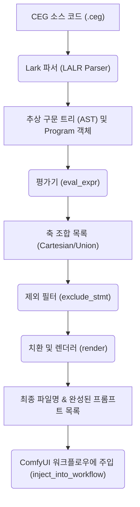

# ComfyEmotionGen (CEG) 문법 가이드 및 학습서

이 문서는 AI 이미지 배치(Batch) 프롬프트 생성을 위한 **CEG DSL (Domain Specific Language)**의 공식 문법 가이드라인입니다. 기본적인 변수 활용부터 조합 폭발을 방지하는 고급 수식, 논리적 모순을 거르는 복합 제외 필터링까지 단계별 예제와 함께 자세히 다룹니다.

모든 예제는 보컬로이드 캐릭터 **Kasane Teto (카사네 테토)**의 SDXL 이미지 생성 프롬프트 스타일을 예시로 채택하여 작성되었습니다.

---

## 1. CEG 문법 구조 한눈에 보기 (Mermaid Diagram)

아래 다이어그램은 CEG 파일이 컴파일되어 개별 이미지 생성 프롬프트와 파일명으로 변환되는 전체적인 데이터 파이프라인을 보여줍니다.



---

## 2. 핵심 문법 및 구성 요소

### 2.1 주석 (Comments)
CEG 코드 가독성을 높이기 위해 주석을 사용할 수 있습니다. 컴파일러는 주석 내부의 문자열을 완벽히 무시합니다.
- **문법**: `{{# 주석 내용 #}}`

### 2.2 전역 변수 설정 (`{{set}}`)
템플릿 전체에서 공통적으로 사용할 문자열 상수나 컴파일러 전용 옵션을 선언합니다.
- **문법**: `{{set 변수명 = "문자열"}}`
- **파일명 자동 정제 옵션**:
  ```ceg
  {{set clean_filename = "true"}}
  ```
  이 옵션이 활성화되면(기본값 `true`), 선택적 축이나 특정 조건에 의해 파일명 내부의 문자열이 비어 있을 때 발생하는 중복 구분자(예: `teto__bikini` 또는 `teto-pajamas-`)를 감지하여 `teto_bikini` 및 `teto-pajamas` 형태로 자동으로 정제해 줍니다.

### 2.3 축 정의 (`{{axis}}`)
조합의 분기가 되는 다차원 '축'을 정의합니다. 키와 프롬프트 값을 일대일 또는 구조화된 형태로 정의할 수 있습니다.
- **기본 정의**:
  ```ceg
  {{axis 축이름}}
    키1 : "값1"
    키2 : "값2"
  {{/axis}}
  ```

- **구조화된 축 (Structured Properties)**:
  단순한 문자열 값 대신 중괄호 `{}`를 이용하여 하위 속성을 가질 수 있어, 동일한 아이템에 대래 옷 스타일, 구도, 어울리는 표정 등을 따로 분리하여 지정할 수 있습니다.
  ```ceg
  {{axis outfit}}
    default : { clothes: "military outfit", shot: "full body" }
  {{/axis}}
  ```
  - `{{outfit}}`: 하위 모든 속성의 값이 쉼표로 자동 연결됩니다 (`military outfit, full body`).
  - `{{outfit.clothes}}`: 특정 속성만 개별 조준하여 치환할 수 있습니다 (`military outfit`).

- **축 공통 포함 (`include="..."`)**:
  축 내부의 모든 값 뒤에 공통적으로 덧붙이고 싶은 태그 문자열이 있을 때 사용합니다. 반복 타이핑을 획기적으로 줄여줍니다.
  ```ceg
  {{axis outfit include="red hair, twin drills"}}
  ```

- **선택적 축 (`?` 수식어)**:
  축 이름 뒤에 물음표를 붙이면 해당 축을 **"아무것도 적용하지 않는 기본 생략 상태"**를 조합에 한 칸 추가합니다.
  ```ceg
  {{axis emotion?}}
  ```
  이를 활용하면 `default_happy`, `default_angry` 뿐만 아니라 표정이 없는 `default` 상태까지 총 3가지 분기가 유연하게 생성됩니다.

### 2.4 조합 활성화 표현식 (`{{combine}}`)
축을 어떻게 버무려서(곱하거나 더하여) 최종 렌더링 목록을 만들지 선언합니다.
- **문법**: `{{combine 표현식}}` 또는 `{{combine alias_이름 = 표현식}}`
- **연산자 종류**:
  1. **곱셈 (`*`)**: 두 개 이상의 축을 교차 결합하는 **데카르트 곱(Cartesian Product)**을 구합니다.
     - 예: `outfit * emotion` -> 3(의상) * 2(표정) = 6가지 조합
  2. **덧셈 (`+`)**: 결합된 시나리오 세트들을 병렬로 연결하는 **합집합(Union)**을 만듭니다.
     - 예: `(outfit * emotion) + (outfit * timeofday)` -> 의상과 표정이 엮인 6개와 의상과 시간대가 엮인 6개를 이어붙여 총 12개 결과물을 단일 파일에서 안전하게 관리합니다. 불필요하게 3차원 곱셈(`outfit * emotion * timeofday` = 12개)을 진행하여 자원을 낭비하지 않는 핵심 기술입니다.
  3. **물결 (`~`, Hide Key)**: 해당 축의 값은 프롬프트 템플릿 파일에는 적용시키되, 생성되는 파일명이나 메타데이터 키 목록에서는 제거합니다.
     - 예: `outfit * ~timeofday` -> 파일명은 `teto_default.png` 형식이 유지되지만 프롬프트 내부에는 `bright sunny day` 등이 온전히 주입됩니다.

### 2.5 제외 규칙 (`{{exclude}}`)
논리적으로 모순되거나 불필요한 조합을 차단합니다.
- **문법**: `{{exclude 조건식 ((AND | OR) 조건식)*}}`
- **지원 조건**:
  - `axis = option` (일치 여부)
  - `axis in [option1, option2, ...]` (지정 리스트 포함 여부)
  - `axis not in [option1, option2, ...]` (지정 리스트 제외 여부)
- **예시**:
  ```ceg
  {{exclude outfit = pajamas AND location in [beach, snow]}}
  ```
  잠옷을 입고 해변에 서 있거나 눈 속에서 야외 촬영을 하는 등의 불필요한 경우의 수를 안전하게 걸러냅니다.

### 2.6 템플릿 및 파일명 지정 블록 (`{{template}}`, `{{filename}}`)
- `{{template}}` ... `{{/template}}`: 최종 텍스트 파일(프롬프트)로 변환될 포맷을 지정합니다.
- `{{filename}}` ... `{{/filename}}`: 생성된 이미지 파일의 물리적인 저장 이름 포맷을 지정합니다.
- **치환 원리**: 컴파일러는 `{{변수명}}` 또는 `{{축이름.key}}`, `{{축이름.property}}` 등을 실제 파싱된 데이터로 재귀 치환(최대 5회)하여 정밀 정제한 뒤 출력을 내보냅니다.

---

## 3. 단계별 예시 가이드북

저희가 구현해 둔 6개의 단계별 `.ceg` 파일들을 통해 문법이 실전에서 어떻게 쓰이는지 확인할 수 있습니다.

### 레벨 1: 기본 치환
[01_basic_template.ceg](file:///F:/source/ComfyEmotionGen/examples/ceg/01_basic_template.ceg) 파일은 단 한 줄의 조합 수식 없이 오직 변수 선언과 출력 구문만을 담고 있어 입문하기에 가장 좋습니다.
```ceg
{{set character = "1girl, kasane teto, red hair, twin drills, red eyes"}}
{{template}}
{{character}}, masterpiece, smiling, looking at viewer
{{/template}}
{{filename}}
kasane_teto_basic
{{/filename}}
```
- **생성 개수**: 1개
- **출력 결과**: `1girl, kasane teto, red hair, twin drills, red eyes, masterpiece, smiling, looking at viewer`
- **출력 파일명**: `kasane_teto_basic`

---

### 레벨 2: 기초 다중 조합
[02_simple_axis.ceg](file:///F:/source/ComfyEmotionGen/examples/ceg/02_simple_axis.ceg)는 축(`{{axis}}`)을 설정하여 의상에 따라 다차원 배치 출력을 진행하는 가장 정석적인 문법입니다.
```ceg
{{axis outfit}}
  default : "military-style mechanical outfit, thigh-high boots, arm warmers"
  bikini : "red halterneck bikini, swim ring, beach side"
  pajamas : "cute pink oversized pajamas, fluffy slippers, bedroom"
{{/axis}}

{{combine outfit}}

{{template}}
1girl, kasane teto, {{outfit}}, standing
{{/template}}

{{filename}}
teto_{{outfit.key}}
{{/filename}}
```
- **생성 개수**: 3개
- **출력 파일명**:
  - `teto_default`
  - `teto_bikini`
  - `teto_pajamas`

---

### 레벨 3: 구조화와 공통화
[03_structured_axis.ceg](file:///F:/source/ComfyEmotionGen/examples/ceg/03_structured_axis.ceg)는 단순 텍스트 나열을 넘어 각 아이템에 어울리는 구도, 연출 속성을 부여하고 공통 캐릭터 특징은 한 번에 묶는 고급 실무 패턴을 보여줍니다.
```ceg
{{axis outfit include="red hair, twin drills, red eyes"}}
  default : { clothes: "military mechanical outfit", shot: "full body", mood: "proud" }
  bikini : { clothes: "red halterneck bikini", shot: "cowboy shot", mood: "playful" }
  pajamas : { clothes: "pink oversized pajamas", shot: "upper body", mood: "sleepy" }
{{/axis}}

{{combine outfit}}

{{template}}
1girl, kasane teto, wearing {{outfit.clothes}}, {{outfit.shot}}, expression is {{outfit.mood}}
{{/template}}
```
- **핵심 포인트**:
  - `{{outfit.clothes}}`로 구조화된 내부 속성에 다이렉트 매핑
  - `include` 옵션에 의해 캐릭터 핵심 외모인 `red hair, twin drills, red eyes`가 최종 렌더링된 `{{outfit}}` 호출부에 자동 분배됨.

---

### 레벨 4: 누락 허용 및 깔끔한 출력
[04_optional_axis.ceg](file:///F:/source/ComfyEmotionGen/examples/ceg/04_optional_axis.ceg)는 무조건 어떤 옵션이 선택되어야만 하는 한계를 탈피하여 "아무 표현도 명시하지 않은 생략 분기"를 만들어 냅니다.
```ceg
{{set clean_filename = "true"}}

{{axis outfit}}
  default : "military mechanical outfit"
  bikini : "red halterneck bikini"
  pajamas : "pink oversized pajamas"
{{/axis}}

{{axis emotion?}}
  happy : "cheerful smile, laughing"
  angry : "angry expression, annoyed pout"
{{/axis}}

{{combine outfit * emotion}}

{{filename}}
teto_{{outfit.key}}_{{emotion.key}}_shot
{{/filename}}
```
- **생성 개수**: 3 * 3 = 9개 (emotion의 happy, angry, 그리고 **생략** 상태)
- **생략 상태의 파일명 결과**: `teto_bikini__shot`이 될 수 있었던 파일명이 `clean_filename` 설정에 의해 완벽하게 `teto_bikini_shot`으로 보정되어 출력됩니다.

---

### 레벨 5: 최고급 조합 연산
[05_expression_operators.ceg](file:///F:/source/ComfyEmotionGen/examples/ceg/05_expression_operators.ceg)는 병렬 시나리오 합산(`+`) 및 파일명 키 숨김(`~`)을 총동원한 완전판 예시입니다.
```ceg
{{combine (outfit * emotion) + (outfit * ~timeofday)}}
```
- **동작 방식**:
  - 의상과 표정이 서로 곱해져 6개 프롬프트 생성.
  - 의상과 시간대가 곱해지며 6개 프롬프트가 추가 결합. (총 12개)
  - 시간대 앞의 `~` 덕분에 시간대가 결합된 파일명은 `teto_expr_bikini_day`가 아니라 `teto_expr_bikini` 형태로 키가 은닉되어 단순하고 보기 좋은 이름으로 떨어집니다.

---

### 레벨 6: 지능적 자원 필터링
[06_complex_exclude.ceg](file:///F:/source/ComfyEmotionGen/examples/ceg/06_complex_exclude.ceg)는 생성 리소스의 낭비를 원천 차단하기 위해 특정 불협화음 조건 조합을 칼같이 배제하는 제외 최적화를 보여줍니다.
```ceg
{{combine outfit * location}}

{{exclude outfit = pajamas AND location in [beach, snow]}}
{{exclude outfit = bikini AND location = snow}}
```
- **필터링 결과**: 총 9개 조합 중에서 잠옷 입은 해변/눈밭 촬영 2개, 비키니 입은 눈밭 촬영 1개를 솎아내어 **최종 6개**의 최적화된 유효 프롬프트만 생성하게 됩니다.

---

## 4. 백엔드 컴파일러 연동 및 로컬 테스트 방법

로컬 터미널에서 백엔드 모듈을 직접 실행하여 여러분이 작성한 `.ceg` 파일들이 정상적으로 파싱되고 조합되는지 직접 모니터링할 수 있습니다.

### 4.1 단일 파일 조합 결과 출력 (CLI)
터미널 환경에서 백엔드 컴파일러 진입점인 `prompt_dsl.py`를 파라미터와 함께 구동하여 렌더링 결과를 바로 확인할 수 있습니다.
```powershell
# PowerShell 또는 CMD 창에서 실행
python backend/prompt_dsl.py examples/ceg/02_simple_axis.ceg
```

### 4.2 ComfyUI 워크플로우에 배치 주입 원리
백엔드 서버(`server.py`)에 주입 명령이 오면 내부적으로 다음과 같이 치환 동작이 이루어져 ComfyUI 노드로 전송됩니다:
```python
# prompt_dsl.py 내부 워크플로우 주입 핵심 메서드
def inject_into_workflow(workflow, prompt, placeholder="{{input}}"):
    # prompt가 딕셔너리면 해당 키를 직접 주입
    # 단순 문자열이면 {{input}} 플레이스홀더를 찾아서 치환
    ...
```
이로 인해 사용자는 프론트엔드 에디터 화면에서 예시 템플릿을 고르고 생성 버튼만 누르면, 백엔드 엔진이 컴파일러를 태운 뒤 자동으로 적합한 노드(예: CLIPTextEncode)의 프롬프트 입력을 교체하며 순차적으로 ComfyUI 대기열(Queue)에 배치 작업을 밀어 넣게 됩니다.
